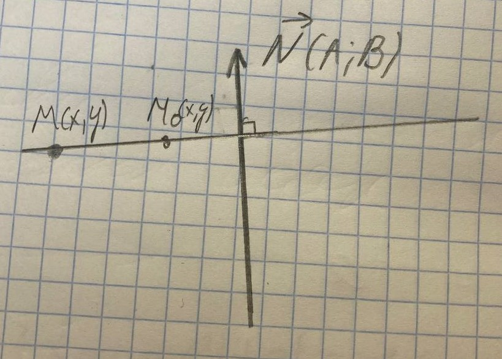
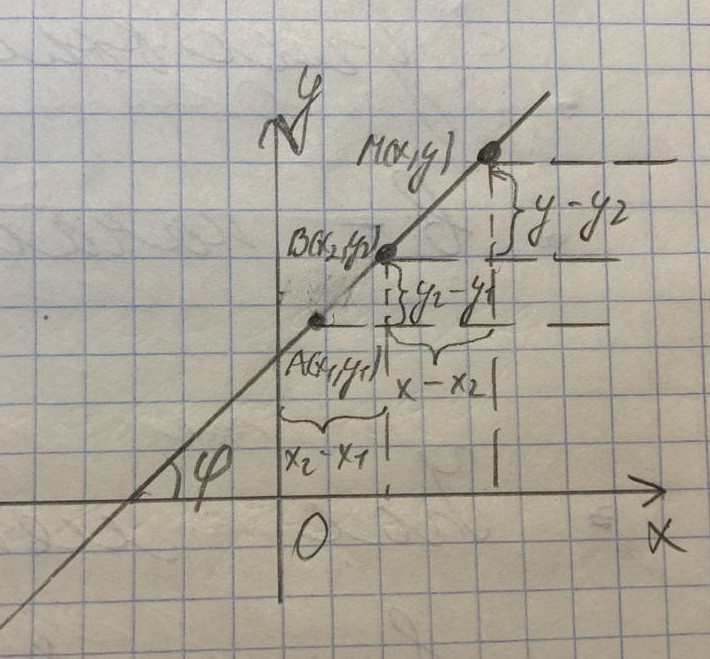
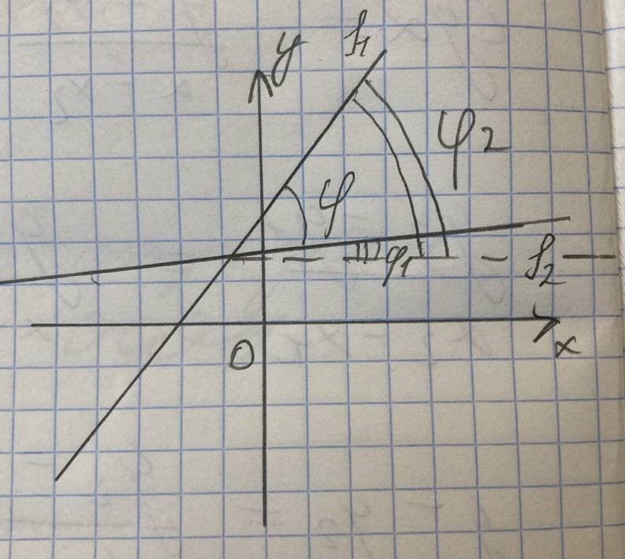
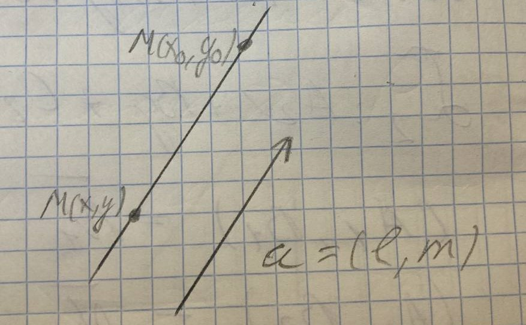
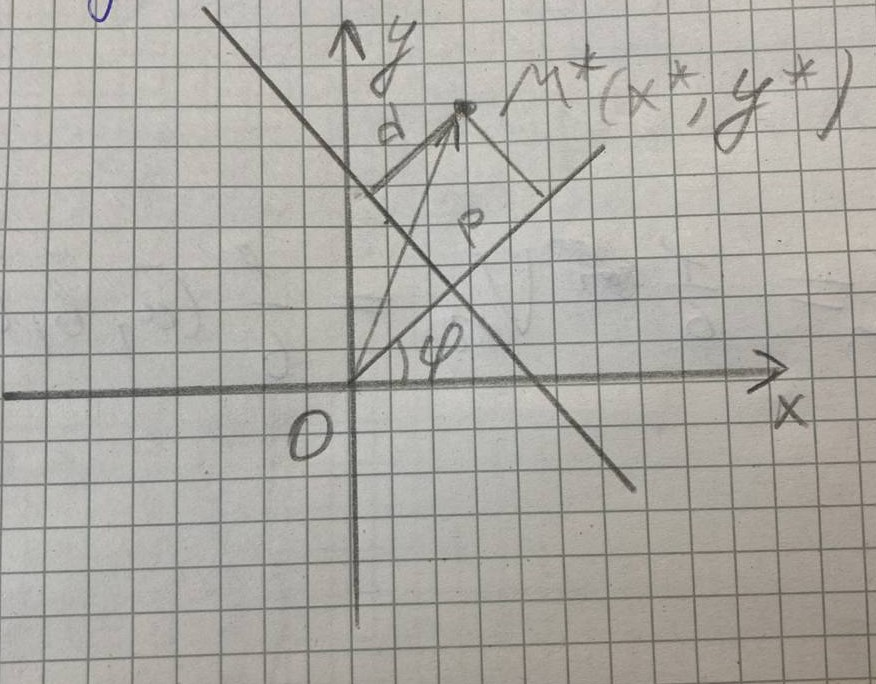

<!-- Macros: start -->
$\newcommand{\block}[2]{\begin{#1} #2 \end{#1}}$
$\newcommand{\cases}[1]{\block{cases}{#1}}$
$\newcommand{\up}[2]{\stackrel{#1}{#2}}$
$\def\dn#1#2{\mathrel{\mathop{#2}\limits_{#1}}}$
$\def\ident{\Longleftrightarrow}$
$\def\thus{\Rightarrow}$
$\newcommand{\set}[1]{ \{ #1 \} }$
$\newcommand{\bigset}[1]{ \left \{ #1 \right \} }$
$\newcommand{\bracs}[1]{ ( #1 ) }$
$\newcommand{\bigbracs}[1]{ \left ( #1 \right ) }$
$\newcommand{\bkets}[1]{\langle #1 \rangle}$
$\newcommand{\bigbkets}[1]{\left \langle #1 \right \rangle}$
$\newcommand{\mat}[1]{\block{Vmatrix}{#1}}$
$\newcommand{\det}[1]{\block{vmatrix}{#1}}$
$\newcommand{\pmat}[1]{\block{pmatrix}{#1}}$
$\newcommand{\emat}[1]{\block{matrix}{#1}}$
$\renewcommand{\geq}{\geqslant}$
$\renewcommand{\leq}{\leqslant}$
$\newcommand{\upline}[1]{\overline{#1}}$
$\newcommand{\dnline}[1]{\underline{#1}}$
$\def\ex{\exists}$
$\def\exo{\ex!}$
$\renewcommand{\phi}{\varphi}$
$\renewcommand{\epsilon}{\varepsilon}$
$\def\alp{\alpha}$
$\def\lam{\lambda}$
$\def\gam{\gamma}$
$\def\eps{\epsilon}$
$\newcommand{\NN}{\mathbb{N}}$
$\newcommand{\ZZ}{\mathbb{Z}}$
$\newcommand{\RR}{\mathbb{R}}$
$\newcommand{\CC}{\mathbb{C}}$
$\newcommand{\FF}{\mathbb{F}}$
$\newcommand{\QQ}{\mathbb{Q}}$
$\newcommand{\EE}{\mathbb{E}}$
$\newcommand\E{\mathbbold{e}}$
$\newcommand\F{\mathbbold{f}}$
$\newcommand\G{\mathbbold{g}}$
$\renewcommand{\int}{\intop}$
$\newcommand{\ans}[1]{\textbf{Ответ}: #1.}$
$\newcommand{\proj}[2]{\text{пр.}_{#1}{#2}}$
$\newcommand{\norm}[1]{\left \lVert #1 \right \rVert}$
$\newcommand{\ord}[1]{\operatorname{ord}(#1)}$
$\renewcommand{\gcd}{\text{НОД}}$
$\newcommand{\lcm}{\text{НОК}}$
<!-- Macros: end -->  

# Аналитическая геометрия  

```{contents} Аналитическая геометрия  
---  
depth: 3  
```  

Преподаватель - Михайлов Владислав Дмитриевич  

## Литература  

- [Клетник Д. В. - "Сборник задач по Аналитической Геометрии"](https://docs.google.com/gview?url=https://mephi-tex.rtfd.io/ru/latest/_static/literature/Сборник_задач_по_аналитической_геометрии_КлетеникДВ.pdf)  

## Лекция 02.09.2022  


### Векторы  

***Определение***  

- Вектор  - это направленный отрезок.  

- Длина вектора $|\vec{AB}|$  

- Краткая запись  $|\vec{a}|$  

***Факт***  
- Векторы коллинеарны, если они лежат на параллельных прямых или на одной прямой  

***Факт***  
- Два вектора называются равными, если равны их длины (модули) и они коллинеарны и соноправлены  

***Факт***  

- Если два вектора коллинеарны, то они отличаются на константу.  


***Свойства***  

**Сложение**  
- По правилу треугольника  
- По правилу паралелограмма  
1.  $ \vec{a} + \vec{b} = \vec{b} + \vec{a}$  
2. $$ \vec{a} + (\vec{b} + \vec{c}) = (\vec{a} + \vec{b}) + \vec{c} $$  

3. $$\exists \vec{0} : \vec{a} + \vec{0} = \vec{a}$$  

4. $$\forall \vec{v} \in \RR^n : \exists \vec{v}^{-1} : \vec{v} + \vec{v}^{-1} = \vec{0} $$  


- Вектором $\lambda \vec{a}$ называется вектор, такой что : $|\lambda\vec{a}| = |\lambda||\vec{a}|$  

- Вектор $\lambda \vec{a}$ коллинеарен вектору $\vec{a}$ и сонаправлен, если $\lambda \geq 0$  

***Свойства***  
**Умножение векторов на константу**  


- $$ \lambda (\vec{a} + \vec{b}) = \lambda\vec{b} + \lambda\vec{a}$$  

- $$ (\lambda + \mu)\vec{a} = \lambda\vec{a} + \mu\vec{b}4$$  

- $$\lambda(\mu\vec{a}) = (\lambda\mu)\vec{a}$$  

### Линейная зависимость системы векторов  


- $\vec{v} = \alpha_{1} \vec{a}_{1} + \alpha_{2} \vec{a}_{2} + ... + \alpha_{n} \vec{a}_{n}$ - линейная комбинация  

- Система линейно зависима, если для линейной комбинации существует $\alpha \in {\alpha_{1}, \alpha_{2}, ... , \alpha_{n}}$ такой, что $\alpha \neq 0$  


- Доказательство : пусть $\alpha_{i} \neq 0$ и линейная комбинация равна нулю.  


1. $\alpha_{1} \vec{a}_{1} + \alpha_{2} \vec{a}_{2} + ... + \alpha_{i - 1} \vec{a}_{i - 1} + \alpha_{i} \vec{a}_{i} + ... + \alpha_{n} \vec{a}_{n} = 0$  

2. $\alpha_{i} \vec{a}_{i} = - \alpha_{1} \vec{a}_{1} - \alpha_{2} \vec{a}_{2} ... - \alpha_{i - 1} \vec{a}_{i - 1} ... - \alpha_{n} \vec{a}_{n}$  

3. т.к. $\alpha_{i} \neq 0$, то можно разделить обе части на $\alpha_{i}$  

4. Получим: $\vec{a}_{i} = -\dfrac{\alpha_{1}}{\alpha_{i}}\vec{a}_{1} - -\dfrac{\alpha_{2}}{\alpha_{i}}\vec{a}_{2} - ... - -\dfrac{\alpha_{i - 1}}{\alpha_{i}}\vec{a}_{i - 1} ... -\dfrac{\alpha_{n}}{\alpha_{i}}\vec{a}_{n}$  

5. Назовем коэффициенты при $\vec{a}_{i}$ --- $\lambda_{i}$, тогда $\vec{a}_{i} = \lambda_{1} \vec{a}_{1} + \lambda_{2} \vec{a}_{2} + ... + \lambda_{i - 1} \vec{a}_{i - 1} + ... + \lambda_{n} \vec{a}_{n}$  

6. Получим представление $\vec{a}_{i}$ в виде остальных векторов  


### Достаточное условие линейной зависимости  
***Теорема***  
- Если в системе векторов присутсвует нулевой вектор, то система линейно зависима.  


***Факт***  
- Если часть векторов системы линейно зависима, то и остальные векторы линейно зависимы  


***Факт***  
 - Если система векторов не является линейно зависимой, то она линейно независима.  

***Теорема***  
- Система линейно независима, если единственная ее линейная комбинация равна нулю.  


***Следствие***  
- Два вектора линейно зависимы тогда и только тогда, когда они колинеарны  

- Если $\vec{a} = \lambda\vec{b}$, то векторы коллинеарны, это и есть линейная зависимость.  

- $3$ вектора линейно зависимы тогда и только тогда, когда они компланарны (лежат в одной или параллельных плоскостях)  

***Упражнение***  

- Пусть $\vec{a}, \vec{b}, \vec{c} $ - линейно зависимы. Доказать компланароность $\{\vec{a}, \vec{b}, \vec{c}\}$. Доказательство : По определению линейной зависимости $\vec{a} = \lambda \vec{b} + \gamma\vec{c}$, тогда $\vec{a}$ лежит в одной плоскости, по правилу паралелограмма. Обратно : Пусть $\vec{a}, \vec{b}, \vec{c} $ - компланарны. Доказать их линейную зависимость.  
- Доказательство : так как векторы лежат в одной плоскости, можно представить один вектор из системы в виде суммы двух других.  


***Утверждение***  

- Любые 4 вектора линейно зависимы в трехмерном пространстве.  

- Доказательство : Пусть даны произвольные 4 вектора $\vec{a}, \vec{b}, \vec{c}, \vec{d}$. Приведем к одному началу эти векторы. На любой тройке этих векторов образуем куб $ABCDA'B'C'D'$. В нем  

1. $\vec{AC} = \vec{AB} + \vec{BC}$  
2. $\vec{AC'} = \vec{AC} + \vec{AA'}$  
3. $\vec{AC'} = \vec{AB} + \vec{BC} + \vec{AA'}$ . Где $\vec{AB} = \alpha\vec{a}, {BC} = \beta \vec{b}, \vec{AA'} = \gamma \vec{c}$.  

4. Получим $\vec{AC'} = D$. Вывод : $D = \alpha\vec{a} + \beta \vec{b} + \gamma \vec{b}$. Следовательно $\{\vec{D}, \vec{a}, \vec{b}, \vec{c}\}$ - линейно зависима.  

***Определение***  

**Базисом** в трехмерном пространстве называется система из трех линейно независимых (неколлинеарных) векторов. Любой вектор соответствующего пространства может быть разложен и при том единственным образом. Коэффициенты этого разложения называются координатами вектора в этом базисе  

***Упражнение***  

- Дано $\{\vec{a}, \vec{b}, \vec{c}\}$ - Базис. Тогда $v \in \RR^3 : v = \alpha\vec{a} + \beta\vec{b} + \gamma\vec{c}.$ $(\alpha, \beta, \gamma)$ - коэффициенты вектора $v$ в базисе $\{\vec{a}, \vec{b}, \vec{c}\}$  

***Определение***  

- **Ортонормированный базис** - базис из попарно перпендикулярных (ортогональных) векторов длины 1. Такие векторы принято называть $\vec{i}, \vec{j}, \vec{k}$.  

**Следствие**  

1. $\vec{a} = X\vec{i} + Y\vec{j} + Z\vec{k}$, $X, Y, Z $ - проекции.  

2. $X^2 + Y^2 + Z^2 = |\vec{a}|^2 \\ $  

3. $\cos{\alpha}^2 + \cos{\beta}^2 + \cos{\gamma}^2 = 1$  


## Лекция 09.09.2022  

### Направляющие косинусы вектора  
- Пусть $\{\vec{a}, \vec{b}, \vec{c}\}$ - ортогональный базис в трехмерном постранстве. Построим паралелепипед $ABCDA'B'C'D'$ на этом наборе векторов. Тогда $\vec{d} = \alpha \vec{a} + \beta \vec{b} + \gamma \vec{c}$  
	1. $pr_{x}{\vec{d}} = X$  
	2. $pr_{y}{\vec{d}} = Y$  
	3. $pr_{z}{\vec{d}} = Z$  
- С другой стороны :   
	1. $X = |d| \cos{\alpha}$  
	2. $Y = |d| \cos{\beta}$  
	3. $Z = |d| \cos{\gamma}$  
- Получим : $X^2 + Y^2 + Z^2 = |d|^2(\cos{\alpha}^2 + \cos{\beta}^2 + \cos{\gamma}^2) \Rightarrow \cos{\alpha}^2 + \cos{\beta}^2 + \cos{\gamma}^2 = 1$  
### Скалярное произведение векторов  

***Определение***  
- Пусть даны два вектора $\vec{a}, \vec{b}$. Скалярным произведенимем этих векторов называют число, такое что $(\vec{a}, \vec{b}) = |\vec{a}||\vec{b}|\cos{\alpha}$  

***Альтернативное определение через проекции.***  
- Пусть даны два вектора $\vec{a}, \vec{b}$ , выходящие из одного начала $O$, с концами в точках $A$ и $B$. Тогда построим перпендикуляр к $\vec{b}$ из $A$. Получим перпендикуляр $AA'$. $OA' = pr_{\vec{b}}{\vec{a}} = |\vec{a}| \cos{\alpha} \Rightarrow (\vec{a}, \vec{b}) = |\vec{a}| pr_{\vec{a}}{\vec{b}} = |\vec{b}| pr_{\vec{b}}{\vec{a}}$  

***Алгебраические свойства***  
1. $(\vec{a}, \vec{b}) = (\vec{b}, \vec{a})$  
2. $(\vec{a} + \vec{b}, \vec{c}) = (\vec{a}, \vec{c}) + (\vec{b}, \vec{c})$  
3. $(\lambda \vec{a}, \vec{b}) = \lambda (\vec{a}, \vec{b})$  
4. $(\vec{a}, \vec{a}) = \vec{a}^2 = |\vec{a}|^2$  

***Упражнение***  
Докажем $(2)$:  
- $(\vec{a}, \vec{c}) = |c|pr_{\vec{c}}{\vec{a}}$  
- $(\vec{b}, \vec{c}) = |c|pr_{\vec{b}}{\vec{a}}$  
- $(\vec{a} + \vec{b}, \vec{c}) = |c|pr_{\vec{c}}{\vec{a} + \vec{b}} = |c|(pr_{\vec{c}}{\vec{a}} + pr_{\vec{c}}{\vec{b}})$  

***Геометрические свойства***  
1. $\vec{a} \perp \vec{b} \Rightarrow (\vec{a}, \vec{b}) = 0$. Стоит заметить что обратно не следует в том случае, если $\vec{a} = \vec{0}$ или $\vec{b} = \vec{0}$  
2. $\phi < 90 \Rightarrow (\vec{a}, \vec{b}) > 0$  $\textbf{Вытекает из определения скаляного произведения}$     
3. $\phi > 90 \Rightarrow (\vec{a}, \vec{b}) < 0 $  $\textbf{Вытекает из определения скаляного произведения}$  

***Определение***  

- $\cos{\phi} = \frac{(\vec{a}, \vec{b})}{|\vec{a}| |\vec{b}| }$  

***Упражнение***  
- Выразим скалярное произведение через координаты перемножаемых векторов. Рассмотрим векторы $\vec{a}, \vec{b}, \vec{c}$ в базисе $\{\vec{i}, \vec{j}, \vec{k}\}$.  
-  Тогда :  
1. $\vec{a} = X_{1}\vec{i} + Y_{1}\vec{j} + Z_{1}\vec{k}$  
2. $\vec{b} = X_{2}\vec{i} + Y_{2}\vec{j} + Z_{2}\vec{k}$  
- $(\vec{a}, \vec{b}) = (X_{1}\vec{i} + Y_{1}\vec{j} + Z_{1}\vec{k}, X_{2}\vec{i} + Y_{2}\vec{j} + Z_{2}\vec{k})$. Т.к. $\{\vec{i}, \vec{j}, \vec{k}\}$ - ортонормированный, то $(\vec{i}, \vec{j}) = (\vec{i}, \vec{k}) = (\vec{j}, \vec{k}) = 0$, а $(\vec{i}, \vec{i}) = (\vec{k}, \vec{k}) = (\vec{j}, \vec{j}) = 1$  $\Rightarrow (\vec{a}, \vec{b}) = X_{1}X_{2}(\vec{i}, \vec{i}) + Y_{1}Y_{2}(\vec{k}, \vec{k}) + Z_{1}Z_{2}(\vec{j}, \vec{j}) =X_{1}X_{2} +  Y_{1}Y_{2} + Z_{1}Z_{2}$  
    Скалярное произведение можно рассматривать как произведение силы $F$ на путь $AB$. $\vec{F} = |F||AB|\cos{\phi}$.  
### Векторное произведение векторов  
***Обозначение***  
- $[\vec{a}, \vec{b}]$  

***Определение***  
- $[\vec{a}, \vec{b}]$ - вектор, такой что: $|[\vec{a}, \vec{b}]| = |\vec{a}||\vec{b}| \sin \phi$. Кроме того этот вектор $\perp$ плоскости перемножаемых векторов.  

***Определение***  
- Векторы $\vec{a}, \vec{b}, \vec{c}$ образуют **правую тройку**, если с конца $\vec{a}$ вращение от $\vec{b}$ к $\vec{c}$ по кратчайшему направлению предоставляется происходящим против часовой стрелки, при условии приведения к одному началу.  

- Тут показывать надо, но попробую описать словами: берем правую руку, и нумеруем пальцы начиная с большого (большой — первый вектор, указательный — второй, средний — третий). Такую тройку векторов назовём «правой».Аналогично можно сделать для левой руки. Суть в том, что никакую правую тройку векторов невозможно перевести в  левую (так чтобы в процессе тройка оставалось базисом)  

***Пример***  

- $\{[\vec{a}, \vec{b}], \vec{a}, \vec{b}\}$ является правой тройкой векторов.  

***Геометрические свойства.***  
1. Если $\vec{a}, \vec{b}$ - коллинеарны, то $[\vec{a}, \vec{b}] = \vec{0}.$ Т.к $[\vec{a}, \vec{b}] = |\vec{a}||\vec{b}| \sin{\phi}$. $\phi = 0$ или $\phi = \pi \Rightarrow \sin{\phi} = 0$.  
2. $ \textbf{Геометрический смысл.}$ $|[\vec{a}, \vec{b}]| = S_{AB} $. $[\vec{a}, \vec{b}]$ = $S_{AB} \vec{e} $. Где $AB$ - паралелограмм, образованный на $\{\vec{a}, \vec{b}\}$, а $\vec{e}$ - единичный вектор вдоль $[\vec{a}, \vec{b}]$.  

***Алгебраические свойства***  

1. $[\vec{a}, \vec{b}] = - [\vec{b}, \vec{a}]$. Следует из ориентации.  
2. $[\vec{a} + \vec{b}, \vec{c}] = [\vec{a}, \vec{c}] + [\vec{b}, \vec{c}]$. Распределительное свойство.  
3. $[\vec{a}, \vec{a}] = \vec{0}$. $(\vec{a}$ - коллинеарен $\vec{a})$  

### Смешанное произведение векторов   

***Определение***  
- $([\vec{a}, \vec{b}], \vec{c})$  

***Геометрическое свойство***  
- $([\vec{a}, \vec{b}], \vec{c}) = V_{ABCDA'B'C'D'}$. Где $ABCDA'B'C'D'$ - паралелепипед, построенный на тройке $\{\vec{a}, \vec{b}, \vec{c}\}$. (Взят с плюсом, если тройка правая и с минусом иначе).  

***Упражнение***  
Докажем : $([\vec{a}, \vec{b}], \vec{c}) = V_{ABCDA'B'C'D'}$  
1. Действительно, $[\vec{a}, \vec{b}]$ - есть $\perp$ к плоскости $A_{\vec{b}, \vec{a}} \Rightarrow [\vec{a}, \vec{b}] = S_{AB}$.  
2. $([\vec{a}, \vec{b}], \vec{c}) = |\underbrace{[\vec{a}, \vec{b}]}_{S_{AB}}||\vec{c}|\cos{\gamma} = |[\vec{a}, \vec{b}]| \cdot pr_{[\vec{a}, \vec{b}]}(c) = V_{ABCDA'B'C'D'}$  

***Следствие***  
- $([\vec{a}, \vec{b}], \vec{c}) = (\vec{a}, [\vec{b}, \vec{c}]) = (\vec{a}, \vec{b}, \vec{c})$  

***Свойства смешанного произведения векторов***  
1. $(\vec{a}, \vec{b}, \vec{b}) = (\vec{a}, [\vec{b}, \vec{b}] = \vec{0}) = 0$  
2. Необходимое и достаточное условие компланарности трех векторов : $(\vec{a}, \vec{b}, \vec{c}) = 0$.  
3.  Выражение векторного произведения через координаты перемножаемых векторов. Пусть:   
1. $\vec{a} = X_{1}\vec{i} + Y_{1}\vec{j} + Z_{1}\vec{k}$  
2. $\vec{b} = X_{2}\vec{i} + Y_{2}\vec{j} + Z_{2}\vec{k}$  
3. $[\vec{a}, \vec{b}] = [X_{1}\vec{i} + Y_{1}\vec{j} + Z_{1}\vec{k}, X_{2}\vec{i} + Y_{2}\vec{j} + Z_{2}\vec{k}]= X_{1}X_2\underbrace{[\vec{i}, \vec{i}]}_{\vec{0}} + X_{1}Y_2\underbrace{[\vec{i}, \vec{j}]}_{\vec{k}} + Z_{1}Z_2\underbrace{[\vec{k}, \vec{k}]}_{\vec{0}} + X_{1}Z_{2}\underbrace{[\vec{i}, \vec{k}]}_{-\vec{j}} + Y_{1}Y_2\underbrace{[\vec{j}, \vec{j}]}_{\vec{0}} + Y_{1}Z_{2}\underbrace{[\vec{j}, \vec{k}]}_{\vec{i}} \dots =$  
   $\begin{equation*}  
                \begin{vmatrix}  
                \vec{i} & \vec{j} & \vec{k} \\  
                X_{1} & Y_{1} & Z_{1} \\  
                X_{2}  & Y_{2} & Z_{2}   
                \end{vmatrix}  
                =  
                \vec{i} \cdot  
                \begin{vmatrix}  
                Y_{1} & Z_{1} \\  
                Y_{2} & Z_{2}  
                \end{vmatrix}  
                -\vec{j} \cdot  
                \begin{vmatrix}  
                X_{2} & Z_{1} \\  
                X_{2} & Z_{2}  
                \end{vmatrix}   
               + \vec{k} \cdot  
                           \begin{vmatrix}  
                           X_{1} & Y_{1} \\  
                           X_{2} & Y_{2}  
                           \end{vmatrix}   
   \end{equation*}$  


***Свойства***  
1. $\vec{a} = X_{1}\vec{i} + Y_{1}\vec{j} + Z_{1}\vec{k}$  
2. $\vec{b} = X_{2}\vec{i} + Y_{2}\vec{j} + Z_{2}\vec{k}$  
3. $\vec{c} = X_{3}\vec{i} + Y_{3}\vec{j} + Z_{3}\vec{k}$  

- Получим :  
- $ \begin{equation*}  
            (\vec{a}, \vec{b}, \vec{c}) = ([\vec{a}, \vec{b}], \vec{c}) \Rightarrow (\vec{a}, \vec{b}, \vec{c}) =   
            \begin{vmatrix}  
            X_{1} & Y_{1} & Z_{1} \\  
            X_{2}  & Y_{2} & Z_{2}  \\  
            X_{3}  & Y_{3} & Z_{3}   
            \end{vmatrix}  
        \end{equation*}$  

***Упражнение***  

**С помощью смешанного произведения легко доказываются свойства векторного произвдения}**  

1.  Тривиально  
2. Умножим скалярно обе части на $\vec{b}$. $([\vec{a} + \vec{b}, \vec{c}], \vec{b}) = ([\vec{a}, \vec{c}], \vec{b}) + \underbrace{([\vec{b}, \vec{c}], \vec{b})}_{0}$. Поскольку $\{[\vec{a} + \vec{b}, \vec{c}], \vec{a}, \vec{b}\} \perp \vec{c}$, значит они компланарны $\Rightarrow$ один из них - линейная комбинация двух других $\Rightarrow S_{[\vec{a} + \vec{b}, \vec{c}]} = S_{[\vec{a}, \vec{c}]} + S_{[\vec{b}, \vec{c}]}$.  

## Лекция 24.09.2022  

### Алгебраическое выражение геометрических образов  
- Рассмотрим задачу:  
	- В прямоугольной декартовой системе координат на плоскости получить уравнение прямой, проходящей через данную точку $M_{0}(x_{0}, y_{0})$, перпендикулярной данному вектору $\vec{N}(A; B)$.  
  
- Возьмем точку с текущими координатами $M(x, y)$  
- Необходимое и достаточное условие принадлежности точки $M(x, y)$ указанной прямой есть равенство скалярного произведения $(\vec{N}, M_{0}M) = 0$. $\vec{N} = (A; B), M_{0}M = (x - x_{0}, y - y_{0})$.  
- Получим $A(x - x_{0}) + B(y - y_{0}) = 0$  

***Определение нормали***  
- Любой вектор, перпендикулярныйц прямой называется ее нормальным вектором или нормалью.  

### Общее уравнение прямой  
- Раскроем $A(x - x_{0}) + B(y - y_{0}) = 0$  
- $Ax + By  + \underbrace{- Ax_{0} - By_{0}}_{C} = 0$  
- $Ax + By + C= 0$  
-   
### Неполные уравнения прямой  
- $C = 0$, $A \neq 0$, $B \neq 0 \implies Ax + By = 0 \implies y = -\frac{A}{B}x \implies y = kx$, $k$ - угловой коэффициент.  
- $C = 0$, $A = 0$, $B \neq 0 \implies By = 0 \implies y = 0$. Получим уравнение оси $Ox$.  
- $C = 0$, $A \neq 0$, $B = 0 \implies Ax = 0 \implies x = 0$. Получим уравнение оси $Oy$.  

***Определение координат нормали***  
- $(A; B)$ - координаты нормали  

### Уравнение прямой в отрезках на координатных осях  
- $Ax + By + C= 0$  
- $Ax + By = - C$ $| \cdot (- \frac{1}{C})$  
- $- \frac{A}{C}x - \frac{B}{C}y = 1$  
- $\frac{x}{\underbrace{-\frac{C}{A}}_{a}} + \frac{y}{\underbrace{-\frac{C}{B}}_{b}} = 1$  
- $\frac{x}{a} + \frac{y}{b} = 1$  

### Уравнение прямой с угловым коэффициентом  
- Пусть дан угол наклона прямой и оси $Ox$, направленной в положительную сторону. Тогда $\tan{\phi} = k$.   
  
- $\tan{\phi} = \frac{y_{2} - y_{1}}{x_{2} - x_{1}}$  
- $\tan{\phi} = \frac{y - y_{2}}{x - x_{2}}$  
- $\frac{y_{2} - y_{1}}{x_{2} - x_{1}} = \frac{y - y_{2}}{x - x_{2}}$  
- $y - y_{2} = \frac{y_{2} - y_{1}}{x_{2} - x_{1}}(x - x_{2})$. Получим уравнение прямой, проходящей, через две точки.  
- $y - y_{0} = \tan{\phi}(x - x_{0})$  
- $y - y_{0} = k(x - x_{0})$  
- $y = y_{2} + kx - kx_{2} = kx + y_{2} - kx_{2} = kx + b$. Получим уравнение прямой с угловым коэффициентом, где $b$ - начальная ордината.  

### Угол между двумя прямыми  
- Дано :  
- $\ell_{1} : y = k_{1}x + b_{1}$  
- $\ell_{2} : y = k_{2}x + b_{2}$    
   
- $\phi = \phi_{2} - \phi_{1}$  
- $\tan{\phi} = \tan{(\phi_{2} - \phi_{1})} = \frac{\tan{\phi_{2}} - \tan{\phi_{1}}}{1 + \tan{\phi_{1}\tan{\phi_{2}}}} = \frac{k_{2} - k_{1}}{1 + k_{1}k_{2}}$.  
- Заметим, $(1 + k_{1}k_{2} = 0) \implies \phi = \frac{\pi}{2} \implies \ell_{1} \perp \ell_{2}$  
- $(1 + k_{1}k_{2} = 0) \implies k_{1}k_{2} = -1 \implies k_{2} = -\frac{1}{k_{1}}$  

### Условие перпендикулярности, исходя из общего уравнения  
- Дано:   
- $\ell_{1} : A_{1}x + B_{1}y + C_{1}= 0$  
- $\ell_{2} : A_{2}x + B_{2}y + C_{2}= 0$  
- $(A_{1}; B_{1}) = \vec{N_{1}}$ - нормаль $\ell_{1}$  
- $(A_{2}; B_{2}) = \vec{N_{2}}$ - нормаль $\ell_{2}$  
- $(\vec{N_{1}}, \vec{N_{2}}) = 0$ - условие $\ell_{1} \perp \ell_{2}$  

***Определение угла между прямыми через нормали***  

- $\cos{\phi} = \frac{(\vec{N_{1}}, \vec{N_{2}})}{|\vec{N_{1}}|| \vec{N_{2}}|}$ - Угол между нормалями.  

### Каноническое уравнение прямой  

*** Определение направляющего вектора***   

- Через точку $M_{0}(x_{0}, y_{0})$ проведем прямую, параллельную данному вектору $\vec{a} = (\ell, m)$. Этот вектор назывется направляющим вектором прямой $\ell$.    
   

*** Необходимое и достаточное условие принадлежности точки данной прямой***  
- Этим условием является коллинеарность векторов $\vec{M_{0}M}$ и $\vec{a}$.  

***Каноническое уравнение прямой**  
- Так как коллинеарные векторы отличаются на константу, то $\vec{M_{0}M} = \lambda \vec{a}$:  
- $\begin{equation*}  
 \begin{cases}  
   x - x_{0}  = \lambda e\\  
   y - y_{0} = \lambda m  
  \end{cases}  
  \end{equation*} \implies$ $ \begin{equation*}  
   \begin{cases}  
    \lambda = \frac{x - x_{0}}{e} \\  
    \lambda = \frac{y - y_{0}}{m}  
   \end{cases}  
   \end{equation*} = \frac{x - x_{0}}{e} = \frac{y - y_{0}}{m}$  
### Параметрическое уравнение прямой  
- $ \frac{x - x_{0}}{e} = \frac{y - y_{0}}{m} = t$  
- $ \begin{equation*}  
   \begin{cases}  
    \frac{x - x_{0}}{e}  = t \\  
    \frac{y - y_{0}}{m} = t  
   \end{cases}  
   \end{equation*} \implies$ $\begin{equation*}  
   \begin{cases}  
    x  = x_{0} + t \\  
    y = y_{0} + t  
   \end{cases}  
   \end{equation*}$  
- $t$  можно трактовать, как время движения точки вдоль прямой.  

### Нормальное уравнение прямой   
  
- Необходимое и достаточное условие принадлежности точки данной: $pr_{\vec{n}(\vec{OM})} = p$ - это уже уравнение прямой. Выразим его в координатах.   
- $pr_{\vec{n}(\vec{OM})} = \frac{(\vec{OM}, \vec{n})}{|\vec{n}|} =(\vec{OM}, \vec{n}) = x\cos{\phi} + y\sin{\phi} = p \implies x\cos{\phi} + y\sin{\phi} - p = 0$  

***Нормальное уравнение прямой из ее общего уравнения***  
- $\implies x\cos{\phi} + y\sin{\phi} - p = 0$  
- $Ax + By + C = 0$ $|(\cdot \frac{1}{\sqrt{A^2 + B^2}})$  
- $\frac{A}{\sqrt{A^2 + B^2}}x + \frac{B}{\sqrt{A^2 + B^2}}y + \frac{C}{\sqrt{A^2 + B^2}} = 0 \implies (\frac{A}{\sqrt{A^2 + B^2}})^2 + (\frac{B}{\sqrt{A^2 + B^2}})^{2} + (\frac{C}{\sqrt{A^2 + B^2}})^2 = 1$  

***Пример***  
1. $3x - 4y + 5 = 0$ $|\cdot (- \frac{1}{5}) \implies - \frac{3}{5}x + \frac{4}{5}y - 1 = 0$  

### Применение нормального уравнения прямой для нахождения расстояния от данной точки до данной прямой    
  

- $pr_{\vec{n}}(\vec{OM}) = \frac{(\vec{OM}, \vec{n})}{|\vec{n}|} = x^{\star} \cos{\phi} + y^{\star} \sin{\phi}$  
- $d = x^{\star} \cos{\phi} + y^{\star} \sin{\phi} - p$. Это верно, если $M^{\star}$ и $O$ лежат по разные стороны от прямой   
   
- $pr_{\vec{n}}(\vec{OM}) = p - d$  

***Обозначение отклонения прямой от точки***  

- $x^{\star} \cos{\phi} + y^{\star} \sin{\phi} - p = \delta$. Где $\delta = \pm d$.  
- $\delta$ - отклонение точки от прямой  

***Задача***   

- Даны две пересекающиеся прямые $\ell_{1}, \ell_{2}$. Получить уравнение биссектрис углов между $\ell_{1}, \ell_{2}$.   
   
- $d_{1} = x \cos{\phi_{1}} + y \sin{\phi_{1}} - p_{1}$  
- $d_{2} = x \cos{\phi_{2}} + y \sin{\phi_{2}} - p_{2}$  
- Расстояние до биссектрис $x \cos{\phi_{1}} + y \sin{\phi_{1}} - p_{1} = \pm (x \cos{\phi_{2}} + y \sin{\phi_{2}} - p_{2})$  